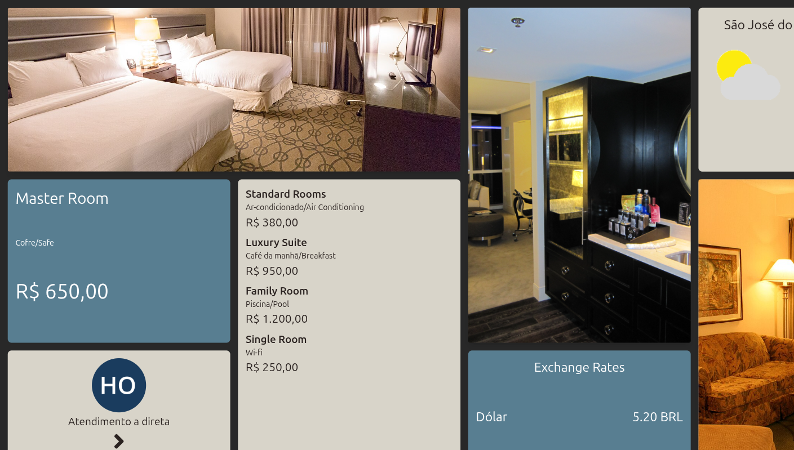
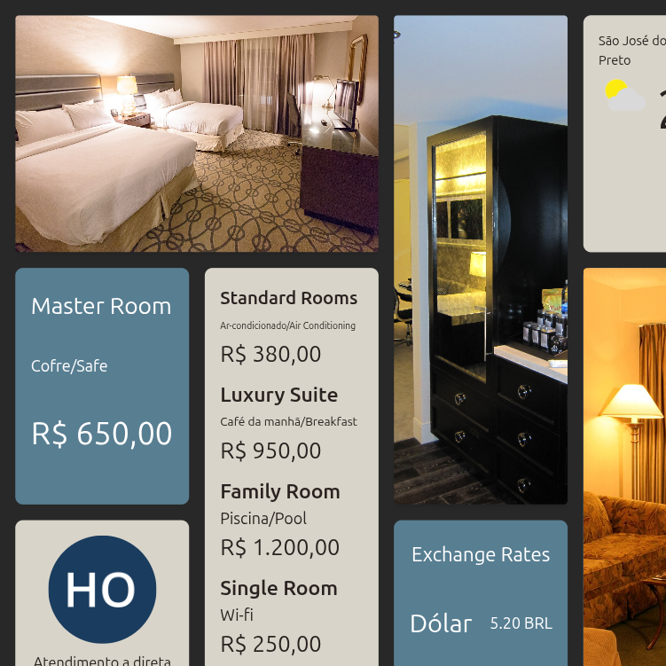

# DSPLAY - Hotel Rates Template

A [React](https://reactjs.org/) [HTML-based template](https://developers.dsplay.tv/docs/html-templates) for the [DSPLAY - Digital Signage](https://dsplay.tv/) platform — a hotel lobby/reception board showing room rates, photos, local weather, and currency exchange rates.

> Built with [Vite](https://vitejs.dev/), requires Node.js 22.22.2+, 24.15.0+, or 26+ (see `.nvmrc`).

## Supported screen formats

| Landscape | Square |
|-----------|--------|
|  |  |

## Template variables

| Key                        | Type   | Description                                                                                     |
|-----------------------------|--------|---------------------------------------------------------------------------------------------------|
| `logo`                      | string | Hotel logo, shown in a circular badge and preloaded before the intro dismisses.                  |
| `background_color`          | string | Background color behind the whole layout.                                                        |
| `image_01`, `image_02`, `image_03` | string | Photos shown in the three image cards.                                                    |
| `primary_card_color` / `primary_card_font_color`     | string | Background/text color for the primary-styled cards.                          |
| `secondary_card_color` / `secondary_card_font_color` | string | Background/text color for the secondary-styled cards.                        |
| `counter_title`             | string | Title shown below the hotel logo.                                                                 |
| `arrow_direction`           | string | Direction of the arrow icon shown under `counter_title` — `up` / `down` / `left` / `right`.      |
| `room_01`..`room_05`        | string | Room name, e.g. "Master Room".                                                                    |
| `room_01_price`..`room_05_price` | string | Room price, e.g. "R$ 650,00".                                                              |
| `room_01_desc`..`room_05_desc`  | string | Room's highlighted amenity, e.g. "Wi-fi".                                                    |
| `exchange_card_title`       | string | Title of the currency exchange card.                                                              |
| `exchange_rate_usd`         | string | Displayed USD exchange rate value.                                                                |
| `exchange_rate_eur`         | string | Displayed EUR exchange rate value.                                                                |
| `city`                      | string | City name shown above the weather widget.                                                        |
| `latitude`, `longitude`     | string | Coordinates used to fetch the local weather. The weather widget is hidden entirely if either is unset. |

> Remember to also register these as Template Vars (same name and type) when configuring this template in the DSPLAY CMS.

## Local development

```sh
npm install
npm start
```

`public/dsplay-data.js` defines `dsplay_config`/`dsplay_media`/`dsplay_template` mock globals used only when the template isn't running inside the actual DSPLAY app. Edit it to try out different values — the DSPLAY Player App replaces it with real content at runtime.

## For developers

- The weather widget calls `https://api.dsplay.tv/weather/current` directly from the browser and caches the response in `localStorage` (see `src/components/weather/index.jsx`) — it isn't a `dsplay_template` variable.
- Layout is built with [Tailwind CSS](https://tailwindcss.com/) utility classes (`tailwind.config.js` / `postcss.config.js`), alongside this project's usual Sass files for the app-level shell (fade-in, screen-format classes).

## Packing (release build)

```sh
npm run zip
```

This builds the template with Vite, which also generates `template-variables.json` + `template-example-data.json` (via [@dsplay/template-manifest](https://www.npmjs.com/package/@dsplay/template-manifest)'s Vite plugin) — the DSPLAY CMS reads these two files to auto-detect this template's variables and seed default preview values. It then generates `template.zip`, ready to be deployed to the [DSPLAY Web Manager](https://manager.dsplay.tv/template/create).

## Test assets

To use test assets (images, videos, etc) during development, put them in the `public/test-assets` folder and reference them in `dsplay-data.js` using their relative path. `public/test-assets` is automatically excluded from the release build.

## Maintaining dependencies

Regular npm dependencies, not vendored files:

```sh
npm outdated
npm update
```

For a version outside the declared range (typically a major bump), apply it deliberately and verify `npm start`, `npm run build`, and `npm test` still work before committing.

### Commit conventions

See [AGENTS.md](AGENTS.md).

## More

To see more about DSPLAY HTML Templates, visit: https://developers.dsplay.tv/docs/html-templates
